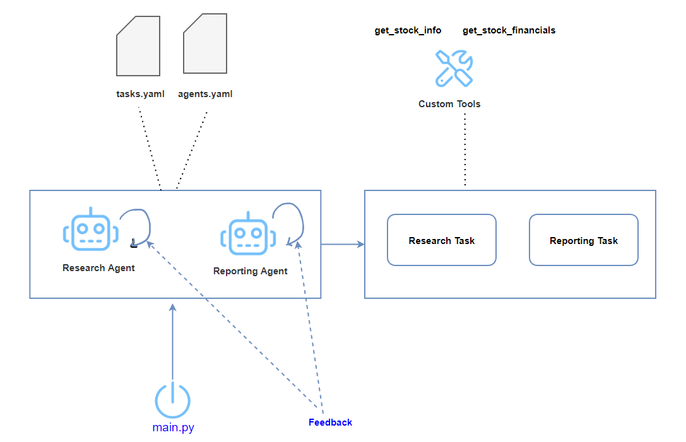

# How I Trained AI Agents


## Introduction

Full Article : [https://medium.com/@learn-simplified/lets-build-ai-agents-that-code-for-you-70b25169a220

Picture this: You're tackling a tricky coding problem, and instead of spending hours searching through documentation or Stack Overflow, you have a personal AI assistant right at your fingertips. This isn't science fiction - it's the reality we're building today. In this article, we'll dive into creating an AI coding assistant that not only answers your questions but also writes and runs code for you. It's like having a brilliant programmer by your side, ready to help 24/7.

## What's This Project About?
This article is your guide to building a powerful AI coding assistant using Python, Streamlit, and Autogen. We'll walk through creating a web application where you can ask coding questions and get instant, interactive responses. The AI doesn't just give you answers - it provides code snippets that you can run right in your browser. We'll cover everything from setting up the AI assistant to creating a user-friendly interface and implementing safe code execution. By the end, you'll have a working prototype of an AI coding buddy that can help streamline your development process.

## Why Use This Project?
In today's fast-paced business environment, efficiency is key. AI is no longer a futuristic concept - it's a present-day tool that can dramatically boost productivity. Imagine a fictional tech startup, CodeNinja Inc., implementing this AI coding assistant. Their developers save hours daily on routine coding tasks, allowing them to focus on innovation and complex problem-solving. 
This article shows you how to bring that same edge to your work or business. Whether you're a solo developer looking to enhance your toolkit or a company aiming to optimize your coding workflow, this AI assistant represents a significant step forward in leveraging AI for practical, day-to-day coding tasks.

## Architecture



# Tutorial: Let's Build AI Agents That Code for You

## Prerequisites
- Python installed on your system.
- A basic understanding of virtual environments and command-line tools.

## Steps

1. **Virtual Environment Setup:**
   - Create a dedicated virtual environment for our project:
   
     ```bash
     python -m venv How_I_Trained_AI_Agents
     ```
   - Activate the environment:
   
     - Windows:
       ```bash
       How_I_Trained_AI_Agents\Scripts\activate
       ```
     - Unix/macOS:
       ```bash
       source How_I_Trained_AI_Agents/bin/activate
       ```

   2. **Install Project Dependencies:**

      - Navigate to your project directory and install required packages using `pip`:
   
        ```bash        
        cd path/to/your/project
        pip install -r requirements.txt
        crewai create crew research_agents
        
        copy main.py & crew.py from my git repo into autogenerated "research_agents/src/research_agents"
        copy .env.example content into .env under autogenerated "research_agents/src/research_agents" add your groq api key
        copy settings.json into autogenerated "research_agents/src/research_agents"
        
        cd  research_agents
        pip install poetry

        poetry add langchain_groq

        poetry lock
        poetry install
      
     
        ```
3. **Install Ollama**
    
    Ollama is a powerful tool for running large language models locally on your machine. Let's walk through the installation process step-by-step.
    
    Step 1: Download Ollama
     - Visit the official Ollama website at https://ollama.com/ and click the "Download" button. The website will automatically detect your operating system and offer the appropriate installer
    
    Step 2: Install Ollama
      - For Windows and Mac users: Double-click the downloaded installer file (.exe for Windows, .dmg for Mac) and follow the on-screen instructions
      - For Linux users: Open a terminal and run the following command:

4. **Run - AI Agent Training**

   ```bash 
   # Run AI Agent Training
   (How_I_Trained_AI_Agents) C:\Users\worka\PycharmProjects\How_I_Trained_AI_Agents\research_agents>crewai run
   ```


